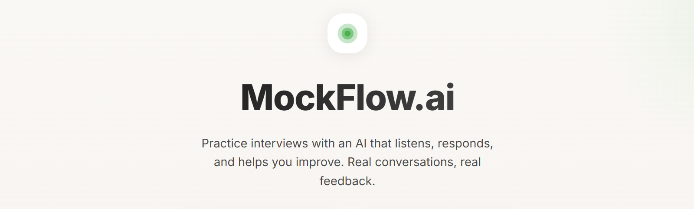

# MockFlow-AI
**AI-Powered Mock Interview Platform with Real-Time Voice Interaction**
<div align="center">



[](https://www.python.org/downloads/)
[](https://docs.livekit.io/agents/)
[](https://platform.openai.com/)
[](https://deepgram.com/)
[](https://flask.palletsprojects.com/)
[](LICENSE)

[Features](#features) • [Architecture](#architecture) • [Installation](#installation) • [Usage](#usage) • [Documentation](#documentation)

</div>

---

## Overview

MockFlow-AI is a cutting-edge mock interview platform that leverages LiveKit's multi-agent AI framework to conduct realistic, voice-based job interviews. Built with industry best practices for real-time voice agents, it provides candidates with an authentic interview experience to practice and improve their skills.

### Key Highlights

- **Real-Time Voice Conversation**: Natural, low-latency voice interaction using LiveKit's WebRTC infrastructure
- **Intelligent Stage Management**: FSM-based interview flow with two distinct stages (self-introduction and past experience)
- **Stable Performance**: Time-based fallback mechanisms ensure continuous workflow progression
- **Production-Ready Architecture**: Built following voice agent best practices from industry leaders

---

## Features

### 🎤 Real-Time Voice Pipeline

- **Speech-to-Text**: Deepgram Nova-2 for accurate transcription
- **Language Model**: OpenAI GPT-4o-mini for intelligent, context-aware responses
- **Text-to-Speech**: OpenAI TTS with natural voice synthesis
- **Voice Activity Detection**: Silero VAD for turn-taking detection

### 🔄 Intelligent Interview Flow

- **Stage 1: Self-Introduction** (3-4 minutes)
  - Candidate introduces themselves
  - AI asks natural follow-up questions
  - Smooth conversation flow with active listening

- **Stage 2: Past Experience** (5-7 minutes)
  - Deep dive into candidate's work history
  - STAR method questioning (Situation, Task, Action, Result)
  - Technical skill evaluation

### 🛡️ Robust State Management

- **Finite State Machine (FSM)**: Explicit state transitions prevent infinite loops
- **State Verification**: Monitors progress every 30 seconds
- **Fallback Mechanism**: Time-based transitions ensure continuous flow
- **No Interruptions/Conflicts**: Well-defined switching logic

### 🚀 Modern Web Interface

- **Bold Minimalist Design**: High-contrast UI following WCAG AA standards
- **Responsive Layout**: Works on desktop, tablet, and mobile
- **Real-Time Status**: Visual indicators for connection and interview stage
- **Audio Visualizer**: Visual feedback during conversation

### 🔮 Future-Ready Architecture

- **Document Processing Module**: Ready for RAG (Retrieval-Augmented Generation)
- **Resume Analysis**: Infrastructure for PDF parsing and context injection
- **Extensible Design**: Easy to add new stages or customize behavior

---

## Architecture

MockFlow-AI follows a microservices architecture with clear separation of concerns:

```
┌─────────────────────────────────────────────────────────────┐
│                        Web Browser                           │
│  ┌─────────────┐  ┌──────────────┐  ┌──────────────┐       │
│  │   Landing   │→ │  Form Page   │→ │Interview Room│       │
│  │    Page     │  │              │  │   (LiveKit)  │       │
│  └─────────────┘  └──────────────┘  └───────┬──────┘       │
└────────────────────────────────────────────┼───────────────┘
                                              │ WebRTC
                                              ↓
┌─────────────────────────────────────────────────────────────┐
│                     Flask Web Server                         │
│  • Serves HTML templates                                     │
│  • Generates LiveKit access tokens                          │
│  • API endpoints for token generation                       │
└─────────────────────────────────────────────────────────────┘
                                              │
                                              ↓
┌─────────────────────────────────────────────────────────────┐
│                   LiveKit Agent Worker                       │
│  ┌──────────────┐  ┌──────────────┐  ┌──────────────┐      │
│  │     FSM      │→ │Interview Agent│→ │State Verifier│      │
│  │  (Stages)    │  │  (Tools)      │  │  (Fallback)  │      │
│  └──────────────┘  └──────────────┘  └──────────────┘      │
│                                                               │
│  Voice Pipeline:                                             │
│  STT (Deepgram) → LLM (OpenAI) → TTS (OpenAI)              │
└─────────────────────────────────────────────────────────────┘
                                              │
                                              ↓
┌─────────────────────────────────────────────────────────────┐
│                     LiveKit Server                           │
│  • WebRTC media routing                                      │
│  • Room management                                           │
│  • Participant coordination                                  │
└─────────────────────────────────────────────────────────────┘
```

### Key Components

1. **FSM Module (`fsm.py`)**: Defines interview stages and state transitions
2. **Agent Module (`agent.py`)**: Implements voice agent with stage-specific instructions
3. **Flask App (`app.py`)**: Web server for UI and token generation
4. **Document Processor (`document_processor.py`)**: Foundation for future RAG implementation

---

## Installation

### Prerequisites

- **Python**: 3.9 or higher (< 3.14)
- **LiveKit Server**: Cloud or self-hosted instance
- **API Keys**: OpenAI and Deepgram accounts

### Step 1: Clone Repository

```bash
git clone https://github.com/yourusername/MockFlow-AI.git
cd MockFlow-AI
```

### Step 2: Install Dependencies

```bash
pip install -r requirements.txt
```

### Step 3: Configure Environment Variables

Create a `.env` file in the project root:

```bash
# LiveKit Server Configuration
LIVEKIT_URL=wss://your-livekit-server.livekit.cloud
LIVEKIT_API_KEY=your_api_key
LIVEKIT_API_SECRET=your_api_secret

# OpenAI Configuration
OPENAI_API_KEY=sk-your-openai-api-key

# Deepgram Configuration
DEEPGRAM_API_KEY=your-deepgram-api-key

# Optional: Logging
LOG_LEVEL=INFO
```

> **Note**: See `env.template` for a complete example.

### Step 4: Verify Installation

```bash
# Test Flask server
python app.py

# In another terminal, test agent
python agent.py dev
```

---

## Usage

### Running the Application

#### Development Mode (Recommended for Testing)

**Terminal 1: Start the Agent**
```bash
python agent.py dev
```

**Terminal 2: Start the Web Server**
```bash
python app.py
```

Access the application at: **http://localhost:5000**

#### Production Mode

**Terminal 1: Start Agent Worker**
```bash
python agent.py start
```

**Terminal 2: Start Web Server**
```bash
gunicorn -w 4 -b 0.0.0.0:5000 app:app
```

### Conducting an Interview

1. **Visit Homepage**: Navigate to `http://localhost:5000`
2. **Fill Registration Form**:
   - Enter your name
   - Provide email address
   - Specify target job role
   - Select experience level
3. **Start Interview**: Click "Start Interview"
4. **Interview Stages**:
   - **Greeting**: Brief introduction from AI interviewer
   - **Stage 1**: Self-introduction discussion (3-4 min)
   - **Stage 2**: Past experience deep dive (5-7 min)
   - **Closing**: Wrap-up and thank you
5. **End Interview**: Click "End Interview" or wait for natural completion

### Tips for Best Experience

- Use a **quiet environment** with minimal background noise
- Speak **clearly and naturally** - the AI understands conversational language
- **Wait for pauses** - the AI uses natural turn-taking
- **Interruptions are allowed** - you can interrupt the AI if needed
- Use **headphones** to prevent audio feedback

---

## Documentation

### Official Documentation

- **[LiveKit Agents](https://docs.livekit.io/agents/)** - Multi-agent AI framework documentation
- **[LiveKit API Reference](https://docs.livekit.io/reference/)** - Complete API documentation
- **[OpenAI API](https://platform.openai.com/docs/)** - LLM and TTS documentation
- **[Deepgram API](https://developers.deepgram.com/)** - Speech-to-text documentation

### Project Documentation

- **[LIVEKIT_ANALYSIS.md](LIVEKIT_ANALYSIS.md)** - Complete analysis of LiveKit framework patterns
- **[VOICE_AGENT_ARCHITECTURE.md](VOICE_AGENT_ARCHITECTURE.md)** - Industry best practices for voice agents
- **[UPDATED_STARTER_GUIDE.md](UPDATED_STARTER_GUIDE.md)** - Implementation guide and architecture decisions

### Code Structure

```
MockFlow-AI/
├── agent.py                    # LiveKit agent with FSM
├── app.py                      # Flask web server
├── fsm.py                      # Finite State Machine
├── document_processor.py       # Document processing (future RAG)
├── requirements.txt            # Python dependencies
├── .env                        # Environment configuration
├── templates/                  # HTML templates
│   ├── index.html              # Landing page
│   ├── form.html               # Registration form
│   ├── interview.html          # Interview room
│   └── error.html              # Error pages
├── static/                     # Static assets
│   ├── styles.css              # Application styles
│   └── script.js               # Client-side JavaScript
├── logs/                       # Application logs
└── agents/                     # LiveKit agents repository
```

---

## Configuration

### Agent Configuration

Edit stage instructions in `agent.py`:

```python
INSTRUCTIONS = {
    InterviewStage.GREETING: "Your greeting instructions...",
    InterviewStage.SELF_INTRO: "Your self-intro instructions...",
    # ...
}
```

### Timing Configuration

Adjust stage time limits in `agent.py`:

```python
STAGE_LIMITS = {
    InterviewStage.GREETING: 90,       # 1.5 minutes
    InterviewStage.SELF_INTRO: 360,    # 6 minutes
    InterviewStage.PAST_EXPERIENCE: 480,  # 8 minutes
}
```

### Voice Pipeline Configuration

Customize STT, LLM, and TTS settings in `agent.py`:

```python
session = AgentSession(
    stt=deepgram.STT(model="nova-2"),
    llm=openai.LLM(model="gpt-4o-mini", temperature=0.7),
    tts=openai.TTS(voice="alloy", speed=1.0),
    # ...
)
```

---

## Troubleshooting

### Common Issues

**Issue**: "Connection failed" error
- **Solution**: Verify LiveKit server URL and credentials in `.env`
- Check that LiveKit server is accessible

**Issue**: Agent doesn't respond
- **Solution**: Ensure `agent.py` is running in another terminal
- Check logs for errors: `tail -f logs/*.log`

**Issue**: Poor audio quality
- **Solution**:
  - Check internet connection quality
  - Use wired connection instead of WiFi if possible
  - Reduce background noise

**Issue**: Stage doesn't transition
- **Solution**:
  - Wait for fallback timer (check logs)
  - Verify LLM is calling `transition_stage` tool
  - Check stage time limits in configuration

### Debug Mode

Enable detailed logging:

```bash
export LOG_LEVEL=DEBUG
python agent.py dev
```

### Health Check

```bash
curl http://localhost:5000/api/health
```

---

## Roadmap

### Upcoming Features

- [ ] **Resume Upload & Analysis**: RAG-based context injection from candidate resumes
- [ ] **Interview Reports**: Detailed feedback and performance analysis
- [ ] **Custom Question Banks**: User-defined question sets for specific roles
- [ ] **Multi-Language Support**: Interviews in multiple languages
- [ ] **Recording & Playback**: Save and review interview sessions

### Future Enhancements

- WebSocket-based stage updates for real-time UI synchronization
- Advanced analytics dashboard for interview performance
- Team collaboration features for mock interview practice
- Integration with job boards and ATS systems

---

## Contributing

Contributions are welcome! Please follow these guidelines:

1. Fork the repository
2. Create a feature branch: `git checkout -b feature/your-feature`
3. Follow the coding standards in `.claude/rules.md`
4. Test your changes thoroughly
5. Submit a pull request with a clear description

### Development Guidelines

- **No emojis in code** - Use text indicators only
- **Comprehensive logging** - Log all important operations
- **High contrast UI** - Follow WCAG AA standards (see `.claude/rules.md`)
- **Error handling** - All external calls must have try-except blocks

---

## License

This project is licensed under the MIT License - see the [LICENSE](LICENSE) file for details.

---

## Acknowledgments

- **[LiveKit](https://livekit.io/)** - Real-time communication infrastructure
- **[OpenAI](https://openai.com/)** - Language model and text-to-speech
- **[Deepgram](https://deepgram.com/)** - Speech-to-text transcription
- **[Silero VAD](https://github.com/snakers4/silero-vad)** - Voice activity detection

---

## Contact & Support

- **GitHub Issues**: [Report bugs or request features](https://github.com/yourusername/MockFlow-AI/issues)
- **Documentation**: [Full documentation](https://github.com/yourusername/MockFlow-AI/wiki)
- **Email**: support@mockflow-ai.example.com

---

## Connect with me

<table align="center">
<tr>
<td width="200px">
  
</td>
<td>
  
[](https://portfolio-pranav-mishra-paranoid.vercel.app)
[](https://www.linkedin.com/in/pranavgamedev/)
[](https://portfolio-pranav-mishra-paranoid.vercel.app/resume)
[](https://www.youtube.com/@parano1dgames/featured)
[](https://huggingface.co/Paranoiid)

</td>
</tr>
</table>

<div align="center">

**Built with best practices from industry-leading voice agent architectures**

[⬆ Back to Top](#mockflow-ai)

</div>
