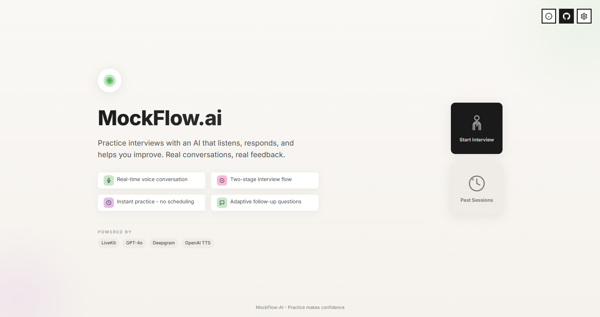

# MockFlow-AI

<div align="center">



**AI-Powered Mock Interview Platform with Real-Time Voice Interaction**

[](https://mockflow-ai.onrender.com)
[](https://www.python.org/downloads/)
[](https://docs.livekit.io/agents/)
[](https://platform.openai.com/)
[](https://deepgram.com/)
[](LICENSE)

[Features](#features) • [Architecture](#architecture) • [Installation](#installation) • [Usage](#usage) • [Documentation](#documentation)

</div>

---

## Overview

MockFlow-AI is a cutting-edge mock interview platform that leverages LiveKit's multi-agent AI framework to conduct realistic, voice-based job interviews. Built with industry best practices for real-time voice agents, it provides candidates with an authentic interview experience to practice and improve their skills.

**Launch Video**: [Watch on YouTube](https://youtu.be/FUFKHy19oGA?si=bgUxkGAZfik8ABhp)
**Full Interview Demo**: [Watch on YouTube](https://youtu.be/iJ7ihwlPEhQ)

### Key Highlights

- **Real-Time Voice Conversation**: Natural, low-latency voice interaction using LiveKit's WebRTC infrastructure
- **Context-Aware Questioning**: Adaptive questions based on resume and job description
- **BYOK Architecture**: Users bring their own API keys for privacy and cost efficiency
- **Production-Ready**: Direct room connections with per-session worker spawning

---

## Features

### 🎤 Real-Time Voice Pipeline

- **Speech-to-Text**: Deepgram Nova-2 for accurate transcription
- **Language Model**: OpenAI GPT-4o-mini for intelligent, context-aware responses
- **Text-to-Speech**: OpenAI TTS with natural voice synthesis
- **Voice Activity Detection**: Silero VAD for turn-taking detection

### 🔄 Intelligent Interview Flow

- **Stage 1: Self-Introduction** (2-3 minutes)
  - Candidate introduces their background and interests
  - AI asks natural, conversational follow-up questions
  - Focus on education, current situation, and motivations

- **Stage 2: Past Experience** (4-5 minutes)
  - Deep dive into candidate's work history and projects
  - Context-aware questions based on uploaded resume
  - Natural probing for challenges, solutions, and impact

- **Stage 3: Company Fit** (3-4 minutes)
  - Role alignment and motivation assessment
  - Questions tailored to job description if provided
  - Career goals and culture fit evaluation


*Screenshot from the interview room*

### 🛡️ Robust State Management

- **Finite State Machine (FSM)**: Explicit state transitions prevent infinite loops
- **State Verification**: Monitors progress every 30 seconds
- **Fallback Mechanism**: Time-based transitions ensure continuous flow
- **No Interruptions/Conflicts**: Well-defined switching logic

### 🚀 Modern Web Interface

- **Bold Minimalist Design**: High-contrast UI following WCAG AA standards
- **Responsive Layout**: Works on desktop, tablet, and mobile
- **Real-Time Status**: Visual indicators for connection and interview stage
- **Audio Visualizer**: Visual feedback during conversation

### 🔮 Future-Ready Architecture

- **Multiple Interview Tracks**: Option to choose between INTRO CALL / Behavioral / TECHNICAL tracks for interview
- **Document Processing Module**: Ready for RAG (Retrieval-Augmented Generation)
- **Resume Analysis**: Infrastructure for PDF parsing and context injection
- **Extensible Design**: Easy to add new stages or customize behavior

---

## Architecture

MockFlow-AI follows a microservices architecture with clear separation of concerns:

```
┌─────────────────────────────────────────────────────────────┐
│                        Web Browser                           │
│  ┌─────────────┐  ┌──────────────┐  ┌──────────────┐       │
│  │   Landing   │→ │  Form Page   │→ │Interview Room│       │
│  │    Page     │  │              │  │   (LiveKit)  │       │
│  └─────────────┘  └──────────────┘  └───────┬──────┘       │
└────────────────────────────────────────────┼───────────────┘
                                              │ WebRTC
                                              ↓
┌─────────────────────────────────────────────────────────────┐
│                     Flask Web Server                         │
│  • Serves HTML templates                                     │
│  • Generates LiveKit access tokens                          │
│  • API endpoints for token generation                       │
└─────────────────────────────────────────────────────────────┘
                                              │
                                              ↓
┌─────────────────────────────────────────────────────────────┐
│                   LiveKit Agent Worker                       │
│  ┌──────────────┐  ┌──────────────┐  ┌──────────────┐      │
│  │     FSM      │→ │Interview Agent│→ │State Verifier│      │
│  │  (Stages)    │  │  (Tools)      │  │  (Fallback)  │      │
│  └──────────────┘  └──────────────┘  └──────────────┘      │
│                                                               │
│  Voice Pipeline:                                             │
│  STT (Deepgram) → LLM (OpenAI) → TTS (OpenAI)              │
└─────────────────────────────────────────────────────────────┘
                                              │
                                              ↓
┌─────────────────────────────────────────────────────────────┐
│                     LiveKit Server                           │
│  • WebRTC media routing                                      │
│  • Room management                                           │
│  • Participant coordination                                  │
└─────────────────────────────────────────────────────────────┘
```

### Current Architecture (Single-Worker Model)

**Current Setup**: A single, shared agent worker handles multiple interview sessions concurrently inside one process using async coroutines.

**How It Works**:
- The worker runs long-lived coroutines for each room connection
- Each session uses an isolated `InterviewState` instance
- Async/await concurrency keeps sessions in one process

**Limitations**:
- Resource contention at scale and CPU/memory exhaustion
- No per-user cost isolation (the server bears API costs)
- Harder to horizontally scale and isolate failures

### Production-Ready Architecture (Recommended)

**Per-Session Worker with BYOK (Bring Your Own Keys)**:

```
[Frontend] → [LiveKit SFU] → [Worker Pool (K8s/Auto-scale)]
  ↓ User API Keys              ↓ Per-room ephemeral worker
[Client Storage]            [Ephemeral Agent Worker]
                 ↓ Uses client keys
              [OpenAI API] [Deepgram API]
```

Key deployment guidance (from DEPLOYMENT.md):
- Use direct room connection (agent connects to a specific room) instead of LiveKit dispatch to avoid stale worker registration.
- Spawn a per-room worker process (ephemeral) that exits after the interview finishes.
- Run worker processes without the dispatch/dev registration flag (e.g. `python agent_worker.py`, not `python agent_worker.py dev`).
- In production use `gunicorn app:app --workers 1 --timeout 120` so subprocess worker management remains reliable.
- Provide an `aiohttp.ClientSession` for plugins that require it (e.g. Deepgram STT) and close it cleanly.
- Optimize Silero VAD settings for low-CPU environments (increase silence thresholds, reduce buffered speech).

**Benefits**:
- Cost and resource isolation per session
- Better crash isolation and horizontal scalability
- Keeps user API keys private (BYOK)

See [DEPLOYMENT.md](DEPLOYMENT.md) and [AGENT_DESIGN.md](AGENT_DESIGN.md) for full deployment notes.

### Key Components

1. **FSM Module (`fsm.py`)**: Defines interview stages, state transitions, and progress tracking
2. **Agent Worker (`agent_worker.py`)**: Implements voice agent with FSM-driven tools and fallback timers
3. **Flask App (`app.py`)**: Web server for UI, OAuth, token generation, and per-session worker spawning
4. **Prompts Module (`prompts.py`)**: Stage-specific instructions and feedback generation prompts
5. **Supabase Client (`supabase_client.py`)**: Encrypted storage for user API keys and interview data
6. **Document Processor (`document_processor.py`)**: Text extraction from resumes (PDF, DOCX, TXT)

---

## Installation

### Prerequisites

- **Python**: 3.9 or higher (< 3.14)
- **LiveKit Server**: Cloud or self-hosted instance
- **API Keys**: OpenAI and Deepgram accounts

### Step 1: Clone Repository

```bash
git clone https://github.com/yourusername/MockFlow-AI.git
cd MockFlow-AI
```

### Step 2: Install Dependencies

```bash
pip install -r requirements.txt
```

### Step 3: Configure Environment Variables

Create a `.env` file in the project root:

```bash
# LiveKit Server Configuration
LIVEKIT_URL=wss://your-livekit-server.livekit.cloud
LIVEKIT_API_KEY=your_api_key
LIVEKIT_API_SECRET=your_api_secret

# OpenAI Configuration
OPENAI_API_KEY=sk-your-openai-api-key

# Deepgram Configuration
DEEPGRAM_API_KEY=your-deepgram-api-key

# Optional: Logging
LOG_LEVEL=INFO
```

> **Note**: See `env.template` for a complete example.

### Step 4: Verify Installation

```bash
# Start the Flask server
python app.py
```

**Note**: In BYOK mode, agent workers are spawned automatically per-session. You don't need to run a separate agent process.

---

## Usage

### Running the Application

The application uses a BYOK (Bring Your Own Keys) model with automatic worker spawning.

#### Development Mode

```bash
python app.py
```

Access the application at: **http://localhost:5000**

#### Production Mode

```bash
gunicorn app:app --workers 1 --timeout 120
```

**Note**: Use `--workers 1` as the application manages agent workers via subprocess spawning.

### First-Time Setup

1. **Visit Homepage**: Navigate to `http://localhost:5000`
2. **Sign In**: Authenticate with Google OAuth
3. **Configure API Keys** (Settings page):
   - LiveKit credentials (URL, API Key, API Secret)
   - OpenAI API Key
   - Deepgram API Key
4. Your keys are encrypted and stored securely

### Conducting an Interview

1. **Start Interview**: Click "Start Interview" from dashboard
2. **Fill Interview Form**:
   - Enter your name and email
   - Specify target job role and experience level
   - (Optional) Upload resume
   - (Optional) Paste job description
3. **Interview Flow**:
   - **Greeting**: Brief introduction from AI interviewer
   - **Stage 1**: Self-introduction discussion (2-3 min)
   - **Stage 2**: Past experience deep dive (4-5 min)
   - **Stage 3**: Company fit and role-specific questions (3-4 min)
4. **Receive Feedback**: Generate detailed feedback after interview completion

### Tips for Best Experience

- Use a **quiet environment** with minimal background noise
- Speak **clearly and naturally** - the AI understands conversational language
- **Wait for pauses** - the AI uses natural turn-taking
- **Interruptions are allowed** - you can interrupt the AI if needed
- Use **headphones** to prevent audio feedback

---

## Documentation

### Official Documentation

- **[LiveKit Agents](https://docs.livekit.io/agents/)** - Multi-agent AI framework documentation
- **[LiveKit API Reference](https://docs.livekit.io/reference/)** - Complete API documentation
- **[OpenAI API](https://platform.openai.com/docs/)** - LLM and TTS documentation
- **[Deepgram API](https://developers.deepgram.com/)** - Speech-to-text documentation

### Project Documentation

- **[AGENT_DESIGN.md](AGENT_DESIGN.md)** - Complete system design, agent architecture, and design decisions
- **[LIVEKIT_ANALYSIS.md](LIVEKIT_ANALYSIS.md)** - Complete analysis of LiveKit framework patterns
- **[VOICE_AGENT_ARCHITECTURE.md](VOICE_AGENT_ARCHITECTURE.md)** - Industry best practices for voice agents
- **[UPDATED_STARTER_GUIDE.md](UPDATED_STARTER_GUIDE.md)** - Implementation guide and architecture decisions

### Code Structure

```
MockFlow-AI/
├── app.py                      # Flask server, OAuth, token generation, worker spawning
├── agent_worker.py             # LiveKit agent with FSM and voice pipeline
├── fsm.py                      # Finite State Machine for interview stages
├── prompts.py                  # Stage instructions and feedback prompts
├── supabase_client.py          # Database client with encrypted API keys
├── auth_helpers.py             # Google OAuth authentication helpers
├── worker_manager.py           # Per-session worker process management
├── postprocess.py              # Transcript merging and formatting utilities
├── conversation_cache.py       # Resume/JD text caching for sessions
├── document_processor.py       # Document text extraction (PDF, DOCX, TXT)
├── requirements.txt            # Python dependencies
├── .env                        # Environment configuration (see env.template)
│
├── templates/                  # HTML templates (Jinja2)
│   ├── index.html              # Landing page with feature overview
│   ├── form.html               # Interview setup form (resume/JD upload)
│   ├── interview.html          # LiveKit interview room
│   ├── dashboard.html          # User dashboard with past sessions
│   ├── feedback.html           # Detailed feedback display
│   ├── settings.html           # User API key management (BYOK)
│   └── error.html              # Error pages (403, 404, 500)
│
├── static/                     # Static frontend assets
│   ├── styles.css              # Main application styles
│   ├── form.css                # Form-specific styles
│   ├── modals.css              # Modal component styles
│   ├── header-additions.css    # Header action button styles
│   ├── header.js               # Reusable header component
│   ├── modal.js                # Modal dialog utilities
│   └── [images, icons]         # Static assets
│
├── logs/                       # Application logs (auto-generated)
├── DEPLOYMENT.md               # Production deployment guide
├── AGENT_DESIGN.md             # System architecture documentation
├── LIVEKIT_ANALYSIS.md         # LiveKit framework analysis
└── VOICE_AGENT_ARCHITECTURE.md # Voice agent best practices
```

---

## Configuration

### Stage Instructions

Edit interview stage prompts in `prompts.py`:

```python
SELF_INTRO = StagePrompt(
    name="Self-Introduction",
    objective="Learn about candidate's background...",
    style="Natural, conversational tone...",
    # ...
)
```

### Timing Configuration

Adjust stage time limits in `fsm.py`:

```python
STAGE_TIME_LIMITS = {
    InterviewStage.GREETING: 90,           # 1.5 minutes
    InterviewStage.SELF_INTRO: 180,        # 3 minutes
    InterviewStage.PAST_EXPERIENCE: 300,   # 5 minutes
    InterviewStage.COMPANY_FIT: 240,       # 4 minutes
}
```

### Voice Pipeline Configuration

Customize STT, LLM, and TTS settings in `agent_worker.py`:

```python
session = VoicePipelineAgent(
    stt=deepgram.STT(model="nova-2-general"),
    llm=openai.LLM(model="gpt-4o-mini", temperature=0.7),
    tts=openai.TTS(voice="alloy", speed=1.0),
    vad=silero.VAD.load(),
    # ...
)
```

---

## Troubleshooting

### Common Issues

**Issue**: "Connection failed" error
- **Solution**: Verify LiveKit credentials in Settings page (or check Supabase)
- Ensure LiveKit server is accessible
- Check that user has configured all required API keys

**Issue**: Agent doesn't respond or interview freezes
- **Solution**: Check that user API keys are valid and have sufficient credits
- Review logs for errors: Check browser console and server logs
- Verify worker process spawned correctly (check `worker_manager.py` logs)

**Issue**: Poor audio quality
- **Solution**:
  - Check internet connection quality
  - Use wired connection instead of WiFi if possible
  - Reduce background noise

**Issue**: Stage doesn't transition
- **Solution**:
  - Wait for fallback timer (check logs)
  - Verify LLM is calling `transition_stage` tool
  - Check stage time limits in configuration

### Debug Mode

Enable detailed logging in your `.env` file:

```bash
LOG_LEVEL=DEBUG
```

Then restart the Flask server. Worker logs will show detailed information about agent sessions.

### Health Check

```bash
curl http://localhost:5000/api/health
```

---

## Contributing

Contributions are welcome! Please follow these guidelines:

1. Fork the repository
2. Create a feature branch: `git checkout -b feature/your-feature`
3. Follow the coding standards in `.claude/rules.md`
4. Test your changes thoroughly
5. Submit a pull request with a clear description

---

## License

This project is licensed under the SAOUL License - see the [LICENSE](LICENSE) file for details.

---

## Acknowledgments

- **[LiveKit](https://livekit.io/)** - Real-time communication infrastructure
- **[OpenAI](https://openai.com/)** - Language model and text-to-speech
- **[Deepgram](https://deepgram.com/)** - Speech-to-text transcription
- **[Silero VAD](https://github.com/snakers4/silero-vad)** - Voice activity detection

---

## Connect with me

<table align="center">
<tr>
<td width="200px">
  
</td>
<td>
  
[](https://portfolio-pranav-mishra-paranoid.vercel.app)
[](https://www.linkedin.com/in/pranavgamedev/)
[](https://portfolio-pranav-mishra-paranoid.vercel.app/resume)
[](https://www.youtube.com/@parano1dgames/featured)
[](https://huggingface.co/Paranoiid)

</td>
</tr>
</table>

<div align="center">

**Built with best practices from industry-leading voice agent architectures**

[⬆ Back to Top](#mockflow-ai)

</div>
