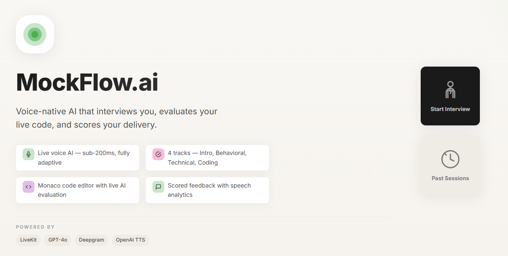

# MockFlow-AI

<div align="center">



**AI-Powered Mock Interview Platform — Voice, Behavioral, Technical & Coding Tracks**

[](https://mockflow-ai.onrender.com)
[](https://www.python.org/downloads/)
[](https://docs.livekit.io/agents/)
[](https://platform.openai.com/)
[](https://deepgram.com/)
[](LICENSE)

[Features](#features) • [Architecture](#architecture) • [Installation](#installation) • [Usage](#usage)

</div>

---

## Overview

MockFlow-AI is a full-stack AI interview coach. It conducts realistic, voice-based mock interviews across four formats — from general intro calls to live coding challenges with a Monaco editor. Built on LiveKit's real-time infrastructure with a BYOK (Bring Your Own Keys) model.

**Launch Video**: [Watch on YouTube](https://youtu.be/FUFKHy19oGA?si=bgUxkGAZfik8ABhp)
**Full Interview Demo**: [Watch on YouTube](https://youtu.be/iJ7ihwlPEhQ)

> **Get your API keys to use the live site:**
> - OpenAI API key → [platform.openai.com](https://platform.openai.com/)
> - Deepgram API key → [console.deepgram.com](https://console.deepgram.com/)
> - LiveKit credentials → [cloud.livekit.io](https://cloud.livekit.io/)
>
> Configure them at **[mockflow-ai.onrender.com](https://mockflow-ai.onrender.com)** → Settings.

---

## Features

### 🎤 Real-Time Voice Pipeline

- **Speech-to-Text**: Deepgram Nova-2 for accurate transcription
- **Language Model**: OpenAI GPT-4o-mini — context-aware, adaptive responses
- **Text-to-Speech**: OpenAI TTS with natural voice synthesis
- **Voice Activity Detection**: Silero VAD for turn-taking

### 🗂 Four Interview Tracks

| Track | Stages | Focus |
|---|---|---|
| **Intro Call** | Welcome → Self-intro → Experience → Company Fit → Closing | General background, motivation, culture fit |
| **Behavioral** | Welcome → Intro → Questions (STAR) → Closing | Leadership frameworks (Amazon / Google / Meta / Generic), configurable follow-up depth |
| **Technical Voice** | Welcome → Intro → Experience → Concepts → Closing | Topic-based conceptual questions; resume-aware topic suggestions |
| **Technical Coding** | Welcome → Warm-up → Problem 1 → Problem 2 → Closing | Live Monaco editor, LLM-generated problems, 15-min timer, 3-attempt retry, real-time code evaluation |

### 🧠 Intelligent Interview Behavior

- **FSM-driven stages**: Explicit state transitions, fallback timers, skip controls
- **Resume + JD aware**: Uploads parsed and injected into context
- **Adaptive follow-ups**: Agent probes based on candidate answers
- **Speech analytics**: Filler word count, WPM, per-turn pace — included in feedback

### 💻 Technical Coding Track

- Live Monaco code editor (Python, JavaScript, Java, C++, Go)
- LLM-generated problems tailored to role + experience level + difficulty
- Per-problem countdown timer with auto-submit
- Up to 3 attempts per problem; real-time AI evaluation with verbal feedback
- Copy/paste disabled for integrity

### 📊 Detailed Feedback System

- Scored breakdown: communication, technical depth, relevance, confidence
- Speech analytics section: filler words, pace (WPM)
- Track-specific evaluation (coding: approach quality, edge cases, complexity)
- Exportable feedback per session

### 🔒 BYOK Architecture

- Users supply their own OpenAI, Deepgram, and LiveKit keys
- Keys encrypted at rest in Supabase; never logged
- Per-session ephemeral worker — keys used only during the interview

---

## Architecture

```
┌─────────────────────────────────────────────────────────────┐
│                        Web Browser                           │
│  ┌─────────────┐  ┌──────────────┐  ┌──────────────┐       │
│  │   Landing   │→ │  Form Page   │→ │Interview Room│       │
│  │    Page     │  │  (4 tracks)  │  │  (LiveKit)   │       │
│  └─────────────┘  └──────────────┘  └───────┬──────┘       │
└────────────────────────────────────────────┼───────────────┘
                                              │ WebRTC
                                              ↓
┌─────────────────────────────────────────────────────────────┐
│                     Flask Web Server                         │
│  • HTML templates, OAuth, token generation                  │
│  • Per-session worker spawning (worker_manager.py)          │
│  • /api/coding/submit, /api/feedback, /api/extract-topics   │
└─────────────────────────────────────────────────────────────┘
                                              │
                                              ↓
┌─────────────────────────────────────────────────────────────┐
│                   LiveKit Agent Worker                       │
│  ┌──────────────┐  ┌──────────────┐  ┌──────────────┐      │
│  │  Multi-Track │→ │Interview Agent│→ │State Verifier│      │
│  │     FSM      │  │  (Tools)      │  │  (Fallback)  │      │
│  └──────────────┘  └──────────────┘  └──────────────┘      │
│                                                              │
│  Voice Pipeline: STT (Deepgram) → LLM (OpenAI) → TTS       │
└─────────────────────────────────────────────────────────────┘
```

### Key Components

| File | Purpose |
|---|---|
| `app.py` | Flask server — OAuth, token generation, worker spawning, feedback endpoints |
| `agent_worker.py` | LiveKit agent — FSM-driven tools, voice pipeline, coding evaluation |
| `fsm.py` | Multi-track FSM — stage enums, time limits, transition logic for all 4 tracks |
| `prompts.py` | Stage instructions, feedback prompts, CODE_EVALUATOR, speech analytics |
| `tracks/` | Per-track config (stage sequences, time limits, availability) |
| `supabase_client.py` | Encrypted API key storage, interview persistence, coding submissions |
| `speech_analytics.py` | Filler word detection, WPM calculation, per-turn pace |
| `document_processor.py` | Resume parsing (PDF, DOCX, TXT) with cache |
| `audio_cache.py` | Pre-generated welcome audio per track |

---

## Installation

### Prerequisites

- Python 3.9+ (< 3.14)
- LiveKit Cloud or self-hosted instance
- OpenAI and Deepgram API keys

### Quick Start

```bash
git clone https://github.com/PranavMishra17/MockFlow-AI.git
cd MockFlow-AI
pip install -r requirements.txt
```

Create `.env`:

```bash
LIVEKIT_URL=wss://your-livekit-server.livekit.cloud
LIVEKIT_API_KEY=your_api_key
LIVEKIT_API_SECRET=your_api_secret
OPENAI_API_KEY=sk-your-openai-api-key
DEEPGRAM_API_KEY=your-deepgram-api-key
```

```bash
python app.py
# Visit http://localhost:5000
```

> In BYOK mode, agent workers are spawned automatically per-session. No separate agent process needed.

### Production

```bash
gunicorn app:app --workers 1 --timeout 120
```

Use `--workers 1` — the app manages agent workers via subprocess spawning.

---

## Usage

### First-Time Setup

1. Visit the site → Sign in with Google OAuth
2. **Settings page** → Add your API keys:
   - LiveKit URL, API Key, API Secret
   - OpenAI API Key
   - Deepgram API Key
3. Keys are encrypted and stored — never re-entered

### Running an Interview

1. **Start Interview** → Select a track:
   - **Intro Call**: General background and fit
   - **Behavioral**: Choose framework + follow-up depth, optional custom questions
   - **Technical Voice**: Select topics (or auto-suggest from resume)
   - **Technical Coding**: Choose language, problem count, difficulty
2. Optionally upload resume / paste job description
3. Connect → interview runs in real time
4. After ending → **Generate Feedback** for scored report

### Tips

- Use headphones to prevent echo
- Speak naturally — the AI handles conversational pauses
- For coding: type your solution, click Submit when ready (up to 3 attempts)

---

## Troubleshooting

| Issue | Fix |
|---|---|
| "Connection failed" | Verify all API keys in Settings; check LiveKit server is reachable |
| Agent doesn't respond | Confirm API keys have credits; check server logs |
| Stage doesn't transition | Wait for fallback timer (~2–5 min per stage); check `LOG_LEVEL=DEBUG` |
| Coding problem not showing | Click "I'm Ready" button after agent greeting |

```bash
# Enable debug logs
LOG_LEVEL=DEBUG python app.py

# Health check
curl http://localhost:5000/api/health
```

---

## Database Migration

Supabase migrations are in `supabase-backend/`:

```bash
# Patch 1 — adds track, track_config columns to interviews table
patch1_migration.sql

# Patch 2 — adds coding_submissions table with RLS
patch2_migration.sql
```

Run these in the Supabase SQL editor before deploying.

---

## Contributing

1. Fork → feature branch → `git checkout -b feature/your-feature`
2. Follow coding standards in `.claude/rules.md`
3. Test thoroughly — especially FSM stage transitions
4. Submit PR with clear description

---

## License

SAOUL License — see [LICENSE](LICENSE).

---

## Acknowledgments

- **[LiveKit](https://livekit.io/)** — Real-time communication infrastructure
- **[OpenAI](https://openai.com/)** — LLM and TTS
- **[Deepgram](https://deepgram.com/)** — Speech-to-text
- **[Silero VAD](https://github.com/snakers4/silero-vad)** — Voice activity detection
- **[Monaco Editor](https://microsoft.github.io/monaco-editor/)** — Code editor

---

## Connect

<table align="center">
<tr>
<td width="200px">
  
</td>
<td>

[](https://portfolio-pranav-mishra-paranoid.vercel.app)
[](https://www.linkedin.com/in/pranavgamedev/)
[](https://portfolio-pranav-mishra-paranoid.vercel.app/resume)
[](https://www.youtube.com/@parano1dgames/featured)
[](https://huggingface.co/Paranoiid)

</td>
</tr>
</table>

<div align="center">

**Built with best practices from industry-leading voice agent architectures**

[⬆ Back to Top](#mockflow-ai)

</div>
