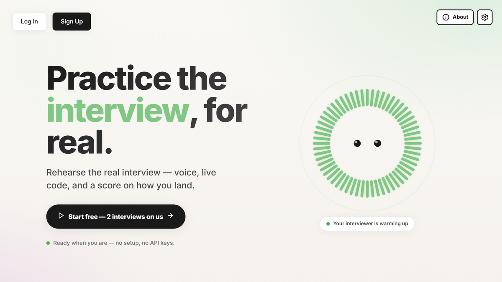
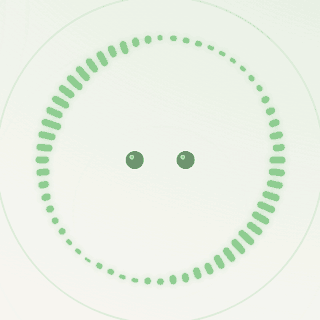
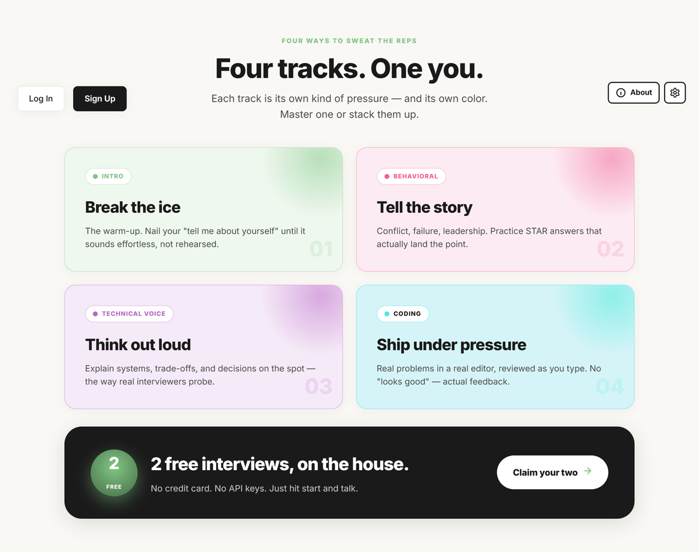
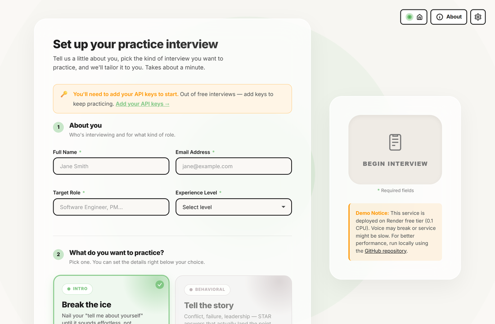

# MockFlow-AI

<div align="center">



**It interviews you out loud, reads your live code as you type, and scores how you actually deliver — like a real panel, on demand.**

[](https://mockflow-ai.onrender.com)
[](https://www.python.org/downloads/)
[](https://flask.palletsprojects.com/)
[](https://docs.livekit.io/agents/)
[](https://platform.openai.com/)
[](https://deepgram.com/)
[](https://neon.tech/)
[](LICENSE)

[Features](#features) • [Tech Stack](#tech-stack) • [Architecture](#architecture) • [Local Setup](#local-setup) • [Testing](#testing) • [Deployment](#deployment)

</div>

---

## What it is

MockFlow-AI is a full-stack AI interview coach that runs realistic, voice-driven mock interviews on demand. A live "panel" greets you out loud, asks adaptive follow-ups, watches the code you type into an in-browser editor, and hands back a scored, competency-based report you can export.

It runs on a **BYOK (Bring Your Own Keys)** model: each user supplies their own LiveKit, OpenAI, and Deepgram credentials, which are encrypted at rest. An **optional, off-by-default** owner-funded free tier can grant new users a couple of interviews on the host's keys.

**Launch Video**: [Watch on YouTube](https://youtu.be/FUFKHy19oGA?si=bgUxkGAZfik8ABhp)
**Full Interview Demo**: [Watch on YouTube](https://youtu.be/iJ7ihwlPEhQ)

> **Want to try the live site?** Bring your own keys and configure them at **[mockflow-ai.onrender.com](https://mockflow-ai.onrender.com)** → Settings:
> - OpenAI API key → [platform.openai.com](https://platform.openai.com/)
> - Deepgram API key → [console.deepgram.com](https://console.deepgram.com/)
> - LiveKit credentials → [cloud.livekit.io](https://cloud.livekit.io/)

---

## Features

### Four interview tracks

| Track | Focus |
|---|---|
| **Intro** | General background, motivation, and culture fit — a warm opening call. |
| **Behavioral** | STAR-style answers against leadership frameworks (Amazon / Google / Meta / generic), with configurable follow-up depth. |
| **Technical (voice)** | Topic-based conceptual questions, with resume-aware topic suggestions. |
| **Coding** | Live Monaco editor against a **vetted problem bank** — real problems with test cases and reference solutions, not LLM-invented one-offs. |

### Real interviewer, not a chatbot



- **Speaks out loud in real time** — STT via Deepgram, LLM + TTS via OpenAI, over LiveKit's WebRTC pipeline.
- **Signature "living orb"** animated interviewer (shown here) that reacts as the conversation moves — built on a reusable CSS/JS motion kit.
- **FSM-driven stages** with explicit transitions, fallback timers, and skip controls so an interview always progresses.
- **Resume + JD aware** — uploads are parsed and injected into the agent's context.

<br clear="right" />

### Four ways to sweat the reps



### Coding track that grades objectively

- Monaco code editor (Python, JavaScript, Java, C++, Go).
- Problems come from a **curated bank** with hidden test cases and reference solutions.
- **Optional real code execution via Piston** (`PISTON_ENABLED`, off by default) that runs your submission and grounds the AI's evaluation in objective pass/fail — not just a vibe check.

### Feedback you can actually use

- **Speech analytics**: filler-word counts, words-per-minute, and per-turn pace.
- **Scored, competency-based feedback**: communication, technical depth, relevance, confidence — plus track-specific dimensions (approach quality, edge cases, complexity for coding).
- **Export to PDF** or **copy as Markdown**.

### Profile dashboard

- An **"Interview Personality"** view with stats: total interviews, average score, breakdown by track, and recency.
- A free-interview badge when the optional free tier is enabled.

### Polished, distinctive UI



- A warm, **light cream/charcoal theme** and a YC-grade landing built to convert.
- A one-page **interview setup**: color-coded track cards, optional resume upload with live feedback, and name/role that cache to your browser.
- A reusable **CSS + JS motion kit** (`static/animations.css`, `static/mf-rays.js`) powering the living orb, with a live gallery at [`/static/animations.html`](static/animations.html).

---

## Tech Stack

| Concern | Technology |
|---|---|
| Web app | **Flask 3** (`app.py`), served by **gunicorn** on Render |
| Voice agent | **LiveKit Agents** (`agent_worker.py`) — one subprocess per interview, spawned via `worker_manager.py` |
| Database | **Neon Postgres** (`db.py`, psycopg3 connection pool) |
| Auth | **Authlib Google OAuth** + **Flask-Login** (`auth_helpers.py`) |
| STT | **Deepgram** |
| LLM + TTS | **OpenAI** |
| Key storage | **Fernet-encrypted** API keys in Postgres (`ENCRYPTION_KEY`) |
| Code execution | **Piston** (optional, off by default) |

There is no MongoDB and no Supabase in the running system. `supabase_client.py` is a thin compatibility shim re-exporting `db.db_client` under its old name.

---

## Architecture

```
Browser (form)  ──POST /api/token──▶  Flask
                                      ├─ load user's encrypted keys from Neon
                                      ├─ worker_manager.spawn_worker()  ──▶ agent_worker.py subprocess
                                      └─ mint LiveKit JWT (user's keys)  ──▶ returned to browser
Browser  ──join LiveKit room──▶  agent_worker (FSM-driven interview)
                                      └─ on end: save transcript to Neon
Browser (feedback) ──POST /api/feedback*──▶  Flask ──▶ OpenAI (user's key) ──▶ scored report
```

The interview state machine (`fsm.py`) is track-aware: `intro`, `behavioral`, `technical_voice`, `technical_coding` (see `tracks/`). Because the BYOK model tracks agent subprocesses in one process's memory, the web server runs as a single gunicorn worker.

| File | Purpose |
|---|---|
| `app.py` | Flask server — OAuth, token generation, worker spawning, feedback endpoints |
| `agent_worker.py` | LiveKit agent — FSM-driven tools, voice pipeline, coding evaluation |
| `worker_manager.py` | Spawns and tracks one agent subprocess per interview |
| `fsm.py` | Multi-track FSM — stage enums, time limits, transition logic |
| `tracks/` | Per-track config (stage sequences, time limits, availability) |
| `db.py` | Neon Postgres pool — encrypted key storage, interview + coding persistence |
| `prompts.py` | Stage instructions, feedback prompts, code evaluator, speech analytics |
| `speech_analytics.py` | Filler-word detection, WPM, per-turn pace |
| `document_processor.py` | Resume parsing (PDF, DOCX, TXT) with cache |

For the full picture, see **[`docs/ARCHITECTURE.md`](docs/ARCHITECTURE.md)**.

---

## Local Setup

### Prerequisites

- Python 3.12 (pinned via `runtime.txt`)
- A Neon Postgres database
- A Google OAuth client (for sign-in)

### Steps

```bash
git clone https://github.com/PranavMishra17/MockFlow-AI.git
cd MockFlow-AI

cp env.template .env          # then fill in the 5 required vars (see below)
pip install -r requirements-dev.txt
```

Run the schema migrations against your Neon database:

```bash
psql "$DATABASE_URL" -f migrations/001_initial_schema.sql
psql "$DATABASE_URL" -f migrations/002_free_tier_and_stats.sql
```

Start the app:

```bash
python app.py
# Visit http://localhost:5000
```

> LiveKit / OpenAI / Deepgram keys are **not** in `.env` — this is a BYOK app. Sign in, open **Settings**, and add your own keys; they're stored Fernet-encrypted. Agent workers spawn automatically per interview, so there's no separate agent process to run.

### Environment variables

Defined in [`env.template`](env.template):

**Required**

| Var | Purpose |
|---|---|
| `DATABASE_URL` | Neon Postgres pooled connection string |
| `GOOGLE_CLIENT_ID` | Google OAuth client ID |
| `GOOGLE_CLIENT_SECRET` | Google OAuth client secret |
| `SECRET_KEY` | Flask session signing key |
| `ENCRYPTION_KEY` | Fernet key encrypting users' stored BYOK keys |

**Optional**

| Var | Purpose |
|---|---|
| `FLASK_ENV` | `production` enables Secure cookies and fails fast on missing vars |
| `CORS_ORIGINS` | Comma-separated allowed origins for `/api/*` |
| `MAX_CONCURRENT_WORKERS` | Cap on concurrent agent subprocesses (default 10) |
| `FREE_TIER_*` | Optional owner-funded free tier (off by default) |
| `SYSTEM_*` | Owner keys backing the free tier (LiveKit / OpenAI / Deepgram) |
| `PISTON_*` | Optional real code execution for the coding track (off by default) |

---

## Testing

```bash
python -m pytest          # unit + integration suite
python -m ruff check .    # lint
```

A **Playwright smoke harness** lives under `tests/e2e/` for end-to-end checks. CI on every push to `main` (`.github/workflows/deploy.yml`) runs ruff + pytest and gates the Render deploy.

To exercise the system **end-to-end by hand** — from Google sign-in through a live voice (and coding) interview to the scored report — follow the step-by-step runbook in **[`docs/TESTING_E2E.md`](docs/TESTING_E2E.md)** (prerequisites, the Google OAuth localhost callback, BYOK keys, and a green-path checklist).

---

## Deployment

Deployed on **Render**:

- **Start command:** `gunicorn app:app --workers 1 --timeout 120`
  (`--workers 1` is required — the BYOK model tracks agent subprocesses in one process's memory.)
- **Python:** pinned via `runtime.txt` (`python-3.12.6`).
- **Health:** `GET /health` pings Neon and reports worker load.
- **Keep-warm:** `.github/workflows/keep-warm.yml` pings the app + Neon roughly every two weeks so the free tier doesn't cold-start.
- Pushes to `main` run CI (lint + tests) before Render auto-deploys.

---

## Roadmap

MockFlow-AI is evolving from a mock-interview tool into a **one-stop interview-prep hub** — the place you run your whole job search from. Planned work:

- **Interview & application tracker.** A lightweight place to log the calls and applications you have coming up — recruiter screens, founder calls, technical assessments, panels — with company, role, date, and notes. The home/dashboard becomes mission control for your search, not just a list of past sessions.
- **"Plan for your actual call" → curated custom tracks.** From the start page, alongside the four standard tracks, an option to prep for a *real* upcoming interview. You provide the company, role, and any details; with your confirmation, a **deep-research agent** gathers context — job description, what the company tends to ask, signals from Glassdoor / Reddit / forums, and the interviewer's background where available — and a **track-builder agent** assembles a tailored interview (recruiter call, founder chat, two-engineer panel, etc.) using the existing track machinery with custom inputs.
- **Personality dashboard, surfaced.** The "Interview Personality" view (already built) grows into a richer behavioral profile after a few sessions — how you come across, recurring filler patterns, pacing, strongest/weakest competencies, and concrete things to work on — and is showcased on the landing page so new users see where they're headed.
- **Free trial slots.** New users get a couple of interviews on the house (no BYOK keys needed) to experience the product before configuring anything.
- **Signed-in vs signed-out experience.** A marketing-grade landing for visitors; a personalized home for signed-in users (free slots remaining, upcoming calls, jump-back-in).

---

## License

SAOUL License — see [LICENSE](LICENSE).

---

## Acknowledgments

- **[LiveKit](https://livekit.io/)** — real-time voice infrastructure
- **[OpenAI](https://openai.com/)** — LLM and TTS
- **[Deepgram](https://deepgram.com/)** — speech-to-text
- **[Neon](https://neon.tech/)** — serverless Postgres
- **[Piston](https://github.com/engineer-man/piston)** — sandboxed code execution
- **[Monaco Editor](https://microsoft.github.io/monaco-editor/)** — in-browser code editor

---

## Connect

<table align="center">
<tr>
<td width="200px">
  
</td>
<td>

[](https://portfolio-pranav-mishra-paranoid.vercel.app)
[](https://www.linkedin.com/in/pranavgamedev/)
[](https://portfolio-pranav-mishra-paranoid.vercel.app/resume)
[](https://www.youtube.com/@parano1dgames/featured)
[](https://huggingface.co/Paranoiid)

</td>
</tr>
</table>

<div align="center">

[⬆ Back to Top](#mockflow-ai)

</div>
